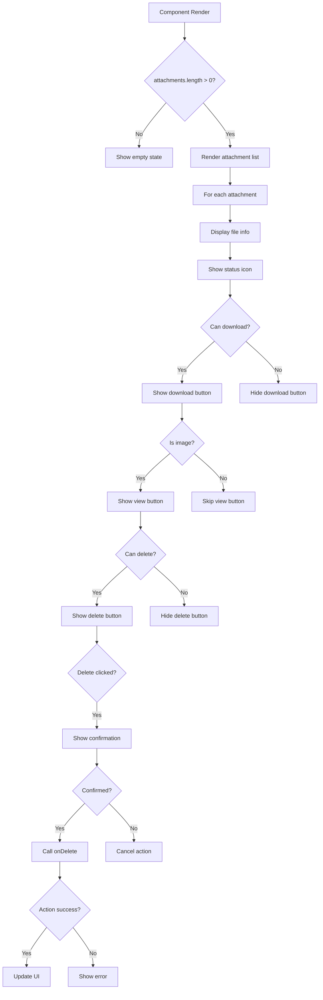

# frontend-component-AttachmentManager.md

## Overview
The `AttachmentManager.jsx` component manages file attachments with download, view, and delete functionality.

## File Location
```
frontend/src/components/AttachmentManager.jsx
```

## Dependencies - Detailed Import Analysis

```jsx
import React, { useState } from 'react';
import { Download, Eye, Trash2, File, Image, AlertCircle, CheckCircle, Clock } from 'lucide-react';
```

### Import Statement Breakdown:
- **React Hook**: `useState` - State management for loading and error states
- **Lucide Icons**: 8 individual icon components for file operations and status indicators

## State Management Syntax

```jsx
const [loading, setLoading] = useState({});
const [errors, setErrors] = useState({});
```

**Syntax Pattern**: Object state for tracking per-attachment loading and error states.

## File Size Formatting Function

```jsx
const formatFileSize = (bytes) => {
  if (bytes === 0) return '0 Bytes';
  const k = 1024;
  const sizes = ['Bytes', 'KB', 'MB', 'GB'];
  const i = Math.floor(Math.log(bytes) / Math.log(k));
  return parseFloat((bytes / Math.pow(k, i)).toFixed(2)) + ' ' + sizes[i];
};
```

**Syntax Pattern**: Mathematical calculations with Math object methods, array indexing.

## MIME Type Detection

```jsx
const getFileIcon = (filename, mimeType) => {
  if (mimeType?.startsWith('image/')) {
    return <Image className="w-5 h-5 text-green-500" />;
  }
  return <File className="w-5 h-5 text-blue-500" />;
};

const getFileTypeColor = (mimeType) => {
  if (mimeType?.startsWith('image/')) return 'text-green-600';
  if (mimeType?.includes('pdf')) return 'text-red-600';
  return 'text-blue-600';
};
```

**Syntax Pattern**: Optional chaining for safe property access, string methods for type checking.

## Event Handlers with Async Operations

```jsx
const handleDownload = async (attachment) => {
  setLoading(prev => ({ ...prev, [attachment._id]: true }));
  setErrors(prev => ({ ...prev, [attachment._id]: null }));

  try {
    await onDownload(attachment);
  } catch (error) {
    setErrors(prev => ({ ...prev, [attachment._id]: error.message }));
  } finally {
    setLoading(prev => ({ ...prev, [attachment._id]: false }));
  }
};
```

**Syntax Pattern**: Functional state updates with object spread, error handling with try-catch-finally.

## Critical Code Patterns

### 1. Object State Updates
```jsx
setLoading(prev => ({ ...prev, [attachment._id]: true }));
```
**Pattern**: Dynamic object property updates using computed property names.

### 2. Optional Chaining for Safe Access
```jsx
if (mimeType?.startsWith('image/')) {
```
**Pattern**: Safe property access without null checks.

### 3. Template Literals for Dynamic Content
```jsx
className={`text-sm ${getFileTypeColor(attachment.mimeType)}`}
```
**Pattern**: Dynamic CSS classes using template literals and function calls.

### 4. Array Mapping with Key Props
```jsx
{attachments.map(attachment => (
  <div key={attachment._id} className="border rounded-lg p-4">
```
**Pattern**: Array mapping with required key prop for React lists.

## State Management
```jsx
const [loading, setLoading] = useState({});
const [errors, setErrors] = useState({});
```

## Key Features

### File Display
- **File Type Icons**: Image vs generic file icons based on MIME type
- **Color-coded Types**: Green for images, red for PDFs, blue for others
- **File Size Formatting**: Human-readable file sizes (Bytes, KB, MB, GB)
- **Upload Information**: Upload date and uploader name display

### Status Indicators
- **Upload Status**: Visual indicators for uploaded/uploading/error states
- **Loading States**: Per-attachment loading indicators during operations
- **Error Display**: Inline error messages for failed operations

### Action Controls
- **Download Button**: Download attachments (when permitted)
- **View Button**: Preview images inline (when applicable)
- **Delete Button**: Remove attachments with confirmation (when permitted)
- **Permission-based UI**: Actions hidden based on user permissions

### User Experience
- **Confirmation Dialogs**: Prevent accidental file deletion
- **Hover Effects**: Interactive feedback on attachment cards
- **Responsive Design**: Mobile-friendly layout
- **Empty State**: Graceful handling of no attachments

## Code Breakdown

### File Size Formatting
```jsx
const formatFileSize = (bytes) => {
  if (bytes === 0) return '0 Bytes';
  const k = 1024;
  const sizes = ['Bytes', 'KB', 'MB', 'GB'];
  const i = Math.floor(Math.log(bytes) / Math.log(k));
  return parseFloat((bytes / Math.pow(k, i)).toFixed(2)) + ' ' + sizes[i];
};
```

### File Type Detection
```jsx
const getFileIcon = (file) => {
  if (file.type?.startsWith('image/')) {
    return <Image className="w-5 h-5" />;
  }
  return <File className="w-5 h-5" />;
};

const getFileTypeColor = (type) => {
  if (type?.startsWith('image/')) return 'text-green-600 dark:text-green-400';
  if (type?.includes('pdf')) return 'text-red-600 dark:text-red-400';
  return 'text-blue-600 dark:text-blue-400';
};
```

### Status Indicators
```jsx
const getStatusIcon = (status) => {
  switch (status) {
    case 'uploaded':
      return <CheckCircle className="w-4 h-4 text-green-500" />;
    case 'uploading':
      return <Clock className="w-4 h-4 text-yellow-500 animate-spin" />;
    case 'error':
      return <AlertCircle className="w-4 h-4 text-red-500" />;
    default:
      return <CheckCircle className="w-4 h-4 text-green-500" />;
  }
};
```

### Action Handlers
```jsx
const handleDownload = async (attachment) => {
  if (loading[attachment.id]) return;
  
  try {
    setLoading(prev => ({ ...prev, [attachment.id]: true }));
    setErrors(prev => ({ ...prev, [attachment.id]: null }));
    
    await onDownload?.(attachment);
  } catch (error) {
    setErrors(prev => ({ 
      ...prev, 
      [attachment.id]: error.message || 'Download failed' 
    }));
  } finally {
    setLoading(prev => ({ ...prev, [attachment.id]: false }));
  }
};

const handleDelete = async (attachment) => {
  if (loading[attachment.id]) return;
  
  if (!window.confirm(`Are you sure you want to delete "${attachment.name}"?`)) {
    return;
  }
  
  try {
    setLoading(prev => ({ ...prev, [attachment.id]: true }));
    setErrors(prev => ({ ...prev, [attachment.id]: null }));
    
    await onDelete?.(attachment);
  } catch (error) {
    setErrors(prev => ({ 
      ...prev, 
      [attachment.id]: error.message || 'Delete failed' 
    }));
  } finally {
    setLoading(prev => ({ ...prev, [attachment.id]: false }));
  }
};
```

## Attachment Data Structure

### Expected Attachment Object
```javascript
{
  id: "attachment_id",
  name: "screenshot.png",
  type: "image/png",
  size: 1024000, // bytes
  status: "uploaded", // "uploaded" | "uploading" | "error"
  uploadedAt: "2024-01-15T10:30:00.000Z",
  uploadedBy: "John Doe"
}
```

## Flow Diagram



## Testing Examples

### Test Empty State
```javascript
render(<AttachmentManager attachments={[]} />);

expect(screen.getByText('No attachments')).toBeInTheDocument();
expect(screen.getByRole('img', { name: /file/i })).toBeInTheDocument();
```

### Test Attachment Display
```javascript
const mockAttachments = [
  {
    id: '1',
    name: 'test.png',
    type: 'image/png',
    size: 1024,
    status: 'uploaded',
    uploadedAt: '2024-01-01',
    uploadedBy: 'John'
  }
];

render(<AttachmentManager attachments={mockAttachments} />);

expect(screen.getByText('test.png')).toBeInTheDocument();
expect(screen.getByText('1.00 KB')).toBeInTheDocument();
```

### Test Download Action
```javascript
const mockOnDownload = jest.fn();
const mockAttachment = { id: '1', name: 'file.txt' };

render(
  <AttachmentManager 
    attachments={[mockAttachment]} 
    onDownload={mockOnDownload}
    canDownload={true}
  />
);

const downloadButton = screen.getByTitle('Download');
fireEvent.click(downloadButton);

expect(mockOnDownload).toHaveBeenCalledWith(mockAttachment);
```

### Test Delete Confirmation
```javascript
const mockOnDelete = jest.fn();
const mockAttachment = { id: '1', name: 'file.txt' };

// Mock window.confirm
window.confirm = jest.fn(() => true);

render(
  <AttachmentManager 
    attachments={[mockAttachment]} 
    onDelete={mockOnDelete}
    canDelete={true}
  />
);

const deleteButton = screen.getByTitle('Delete');
fireEvent.click(deleteButton);

expect(window.confirm).toHaveBeenCalledWith('Are you sure you want to delete "file.txt"?');
expect(mockOnDelete).toHaveBeenCalledWith(mockAttachment);
```

## Performance Considerations
- **Per-attachment Loading**: Individual loading states prevent UI blocking
- **Efficient Re-renders**: Targeted state updates for specific attachments
- **Lazy Operations**: Actions only trigger when explicitly requested
- **Memory Safe**: No large file data stored in component state

## Accessibility Features
- **Semantic HTML**: Proper button elements with titles
- **Keyboard Navigation**: All interactive elements keyboard accessible
- **Screen Reader Support**: Descriptive button titles and status text
- **Color Contrast**: High contrast icons and text
- **Focus Management**: Clear focus indicators for buttons

## Error Handling
- **Operation Failures**: Inline error display for failed downloads/deletes
- **Loading Prevention**: Disable buttons during operations
- **User Confirmation**: Prevent accidental deletions
- **Graceful Degradation**: Component works without all callback props

## Security Considerations
- **Permission Checks**: UI respects permission props
- **Input Validation**: Safe handling of file metadata
- **XSS Prevention**: Proper text escaping for file names
- **CSRF Protection**: Relies on parent component for secure API calls

## Related Files
- **Ticket Detail Page**: Uses AttachmentManager for ticket attachments
- **File Upload Components**: Works with file upload functionality
- **API Utilities**: File download/upload API integration

## Future Enhancements
- Drag and drop reordering
- Bulk operations (download/delete multiple)
- File preview modal for images
- File type filtering
- Search functionality
- File versioning support
- Integration with cloud storage providers