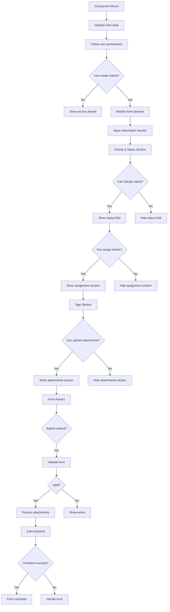

# frontend-component-EnhancedTicketForm.md

## Overview
The `EnhancedTicketForm.jsx` component provides a comprehensive form for creating and editing tickets with validation and file attachments.

## File Location
```
frontend/src/components/EnhancedTicketForm.jsx
```

## Dependencies - Detailed Import Analysis

```jsx
import React, { useState } from 'react';
import { Save, X, AlertCircle, Upload, User, Calendar, Tag } from 'lucide-react';
import ScreenshotUpload from './ScreenshotUpload';
import RoleGuard from './RoleGuard';
import { hasPermission } from '../utils/roles';
```

### Import Statement Breakdown:
- **React Hook**: `useState` - State management for form data and validation
- **Lucide Icons**: 7 individual icon components for form UI
- **Custom Components**: `ScreenshotUpload, RoleGuard` - Specialized components
- **Utility Function**: `hasPermission` - Role-based permission checking

## State Management Syntax

```jsx
const [formData, setFormData] = useState({
  title: initialData.title || '',
  description: initialData.description || '',
  priority: initialData.priority || 'Medium',
  type: initialData.type || 'Bug',
  status: initialData.status || 'Open',
  assignee: initialData.assignee || '',
  tags: initialData.tags || [],
  attachments: initialData.attachments || [],
  ...initialData
});

const [errors, setErrors] = useState({});
const [uploadedFiles, setUploadedFiles] = useState([]);
```

**Syntax Pattern**: Object state with default values using logical OR, spread operator for additional props.

## Form Input Handlers

```jsx
const handleInputChange = (e) => {
  const { name, value } = e.target;
  setFormData(prev => ({
    ...prev,
    [name]: value
  }));
  // Clear error when user starts typing
  if (errors[name]) {
    setErrors(prev => ({
      ...prev,
      [name]: null
    }));
  }
};
```

**Syntax Pattern**: Destructuring assignment, functional state updates, computed property names.

## Tag Management

```jsx
const handleAddTag = (tag) => {
  if (tag && !formData.tags.includes(tag)) {
    setFormData(prev => ({
      ...prev,
      tags: [...prev.tags, tag]
    }));
  }
};

const handleRemoveTag = (tagToRemove) => {
  setFormData(prev => ({
    ...prev,
    tags: prev.tags.filter(tag => tag !== tagToRemove)
  }));
};
```

**Syntax Pattern**: Array spread and filter methods for immutable updates.

## Form Validation

```jsx
const validateForm = () => {
  const newErrors = {};

  if (!formData.title.trim()) {
    newErrors.title = 'Title is required';
  }

  if (!formData.description.trim()) {
    newErrors.description = 'Description is required';
  }

  if (formData.priority && !['Low', 'Medium', 'High', 'Critical'].includes(formData.priority)) {
    newErrors.priority = 'Invalid priority level';
  }

  setErrors(newErrors);
  return Object.keys(newErrors).length === 0;
};
```

**Syntax Pattern**: Object literal for error collection, array includes method for validation.

## Critical Code Patterns

### 1. Computed Property Names
```jsx
setFormData(prev => ({
  ...prev,
  [name]: value
}));
```
**Pattern**: Dynamic object property updates using bracket notation.

### 2. Array Methods for State Updates
```jsx
tags: [...prev.tags, tag]
tags: prev.tags.filter(tag => tag !== tagToRemove)
```
**Pattern**: Spread and filter for immutable array operations.

### 3. Conditional Rendering with Permissions
```jsx
{hasPermission(userRole, 'assign_tickets') && (
  <div className="form-field">
    {/* Assignee field */}
  </div>
)}
```
**Pattern**: Logical AND for conditional rendering based on permissions.

### 4. Object Destructuring in Event Handlers
```jsx
const { name, value } = e.target;
```
**Pattern**: Destructuring event target properties for cleaner code.

## State Management
```jsx
const [formData, setFormData] = useState({
  title: initialData.title || '',
  description: initialData.description || '',
  priority: initialData.priority || 'Medium',
  type: initialData.type || 'Bug',
  status: initialData.status || 'Open',
  assignee: initialData.assignee || '',
  tags: initialData.tags || [],
  attachments: initialData.attachments || [],
  ...initialData
});

const [errors, setErrors] = useState({});
const [uploadedFiles, setUploadedFiles] = useState([]);
```

## Key Features

### Role-Based Access Control
- **Permission Checks**: Different fields visible based on user permissions
- **Create Tickets**: Basic permission required for form access
- **Status Changes**: Advanced permission for status field
- **Assignment**: Special permission for assignee field
- **Attachments**: Upload permission for file attachments

### Form Validation
- **Required Fields**: Title, description, priority, and type validation
- **Real-time Feedback**: Error clearing on field changes
- **Comprehensive Checks**: All required fields validated before submission
- **User-friendly Messages**: Clear error descriptions

### File Attachments
- **Screenshot Upload**: Integrated screenshot capture component
- **File Management**: Multiple file support with size limits
- **Upload Status**: File upload progress and status tracking
- **Permission-gated**: Only users with upload permissions see attachment section

### Tag Management
- **Comma-separated Input**: Simple tag entry with comma separation
- **Array Storage**: Tags stored as arrays for backend compatibility
- **Flexible Tagging**: Support for multiple categorization tags

## Code Breakdown

### Permission Checks
```jsx
const canCreateTicket = hasPermission(userRole, 'create_tickets');
const canUploadAttachments = hasPermission(userRole, 'upload_attachments');
const canAssignTickets = hasPermission(userRole, 'assign_tickets');
```

### Form Validation
```jsx
const validateForm = () => {
  const newErrors = {};
  
  if (!formData.title.trim()) {
    newErrors.title = 'Title is required';
  }
  
  if (!formData.description.trim()) {
    newErrors.description = 'Description is required';
  }
  
  if (!formData.priority) {
    newErrors.priority = 'Priority is required';
  }
  
  if (!formData.type) {
    newErrors.type = 'Type is required';
  }
  
  setErrors(newErrors);
  return Object.keys(newErrors).length === 0;
};
```

### Submission Handler
```jsx
const handleSubmit = async (e) => {
  e.preventDefault();
  
  if (!validateForm()) {
    return;
  }
  
  const submissionData = {
    ...formData,
    createdBy: userId,
    createdAt: new Date().toISOString(),
    attachments: uploadedFiles.map(file => ({
      name: file.name,
      size: file.size,
      type: file.type,
      url: file.uploadedUrl || null,
      filename: file.filename || null,
      status: file.uploadedUrl ? 'uploaded' : 'pending'
    }))
  };
  
  await onSubmit?.(submissionData);
};
```

### Tag Handling
```jsx
const handleTagsChange = (e) => {
  const tags = e.target.value.split(',').map(tag => tag.trim()).filter(Boolean);
  setFormData(prev => ({
    ...prev,
    tags
  }));
};
```

## Form Sections

### Basic Information
- **Title**: Required text input for ticket title
- **Type**: Dropdown selection (Bug, Feature, Improvement, Task)
- **Description**: Required textarea for detailed description

### Priority & Status
- **Priority**: Required dropdown (Low, Medium, High, Critical)
- **Status**: Permission-gated dropdown (Open, In Progress, In Review, Resolved, Closed)

### Assignment
- **Assignee**: Permission-gated dropdown for ticket assignment
- **Role-based Visibility**: Only users with assignment permissions see this section

### Tags
- **Tag Input**: Comma-separated text input for categorization
- **Dynamic Arrays**: Tags converted to arrays for backend storage

### Attachments
- **File Upload**: Integrated ScreenshotUpload component
- **Permission-gated**: Only visible to users with upload permissions
- **File Limits**: Maximum 5 files, 5MB each

## Flow Diagram



## Permission Matrix

| Permission | Member | Core | Admin | Description |
|------------|--------|------|-------|-------------|
| `create_tickets` | ✓ | ✓ | ✓ | Can access ticket creation form |
| `change_ticket_status` | ✗ | ✓ | ✓ | Can modify ticket status |
| `assign_tickets` | ✗ | ✓ | ✓ | Can assign tickets to users |
| `upload_attachments` | ✓ | ✓ | ✓ | Can upload files to tickets |

## Testing Examples

### Test Form Validation
```javascript
render(<EnhancedTicketForm userRole="member" userId="user1" />);

// Try to submit empty form
const submitButton = screen.getByText('Save Ticket');
fireEvent.click(submitButton);

// Check for validation errors
expect(screen.getByText('Title is required')).toBeInTheDocument();
expect(screen.getByText('Description is required')).toBeInTheDocument();
```

### Test Permission-based Rendering
```javascript
// Test member permissions
render(<EnhancedTicketForm userRole="member" userId="user1" />);

expect(screen.queryByText('Status')).not.toBeInTheDocument();
expect(screen.queryByText('Assignee')).not.toBeInTheDocument();
expect(screen.getByText('Attachments')).toBeInTheDocument(); // Members can upload
```

### Test Form Submission
```javascript
const mockOnSubmit = jest.fn();
const formData = {
  title: 'Test Ticket',
  description: 'Test description',
  priority: 'High',
  type: 'Bug'
};

render(
  <EnhancedTicketForm 
    userRole="member" 
    userId="user1" 
    onSubmit={mockOnSubmit}
  />
);

// Fill required fields
fireEvent.change(screen.getByPlaceholderText('Enter ticket title'), {
  target: { value: formData.title }
});
fireEvent.change(screen.getByPlaceholderText('Describe the issue...'), {
  target: { value: formData.description }
});

// Submit
fireEvent.click(screen.getByText('Save Ticket'));

await waitFor(() => {
  expect(mockOnSubmit).toHaveBeenCalledWith(
    expect.objectContaining({
      title: 'Test Ticket',
      description: 'Test description',
      createdBy: 'user1'
    })
  );
});
```

### Test Tag Handling
```javascript
render(<EnhancedTicketForm userRole="member" userId="user1" />);

const tagInput = screen.getByPlaceholderText('frontend, backend, urgent');
fireEvent.change(tagInput, { target: { value: 'frontend, urgent' } });

// Verify tags are processed
expect(tagInput.value).toBe('frontend, urgent');
```

## Performance Considerations
- **Controlled Components**: Efficient state updates for form fields
- **Validation Optimization**: Errors cleared on field changes to prevent unnecessary re-renders
- **Conditional Rendering**: Sections only render when permissions allow
- **File Handling**: Efficient file state management without large data storage

## Accessibility Features
- **Semantic HTML**: Proper form structure with labels
- **Keyboard Navigation**: All form controls keyboard accessible
- **Screen Reader Support**: Descriptive labels and error messages
- **Focus Management**: Logical tab order and focus indicators
- **Color Contrast**: High contrast for form elements and error states

## Error Handling
- **Validation Errors**: Inline error display for required fields
- **Submission Errors**: Handled by parent component via onSubmit callback
- **Permission Errors**: Access denied message for unauthorized users
- **File Upload Errors**: Handled by ScreenshotUpload component

## Security Considerations
- **Permission Validation**: Client-side permission checks (server validation required)
- **Input Sanitization**: Form data validation and sanitization
- **File Upload Security**: File type and size restrictions
- **XSS Prevention**: Safe handling of user input

## Related Files
- **ScreenshotUpload**: File upload component integration
- **RoleGuard**: Permission-based conditional rendering
- **CreateTicket Page**: Uses EnhancedTicketForm for ticket creation
- **Role Utilities**: Permission checking functions

## Future Enhancements
- Rich text editor for descriptions
- Drag and drop file uploads
- Template-based ticket creation
- Auto-save functionality
- Form progress indicators
- Advanced validation rules
- Integration with external issue trackers