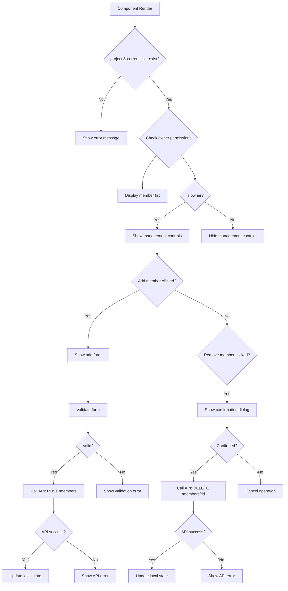

# frontend-component-TeamMemberManager.md

## Overview
The `TeamMemberManager.jsx` component manages team members for projects with add/remove functionality.

## File Location
```
frontend/src/components/TeamMemberManager.jsx
```

## Dependencies - Detailed Import Analysis

```jsx
import React, { useState } from 'react';
import { User, Mail, X, UserPlus, AlertCircle, BadgeCheck, UserX } from 'lucide-react';
```

### Import Statement Breakdown:
- **React Hook**: `useState` - State management for form inputs and UI state
- **Lucide Icons**: 7 individual icon components for UI elements (User, Mail, X, UserPlus, AlertCircle, BadgeCheck, UserX)

## State Management Syntax

```jsx
const [email, setEmail] = useState('');
const [name, setName] = useState('');
const [loading, setLoading] = useState(false);
const [error, setError] = useState('');
const [showAddForm, setShowAddForm] = useState(false);
```

**Syntax Pattern**: Multiple useState hooks for different data types (string, boolean).

## Form Input Handling

```jsx
const handleEmailChange = (e) => {
  setEmail(e.target.value);
  if (error) setError('');
};

const handleNameChange = (e) => {
  setName(e.target.value);
};
```

**Syntax Pattern**: Event handlers with parameter destructuring, conditional error clearing.

## Async Function for API Calls

```jsx
const handleAddMember = async () => {
  if (!email.trim()) {
    setError('Email is required');
    return;
  }

  setLoading(true);
  setError('');

  try {
    const response = await fetch(`/api/projects/${project._id}/members`, {
      method: 'POST',
      headers: { 'Content-Type': 'application/json' },
      body: JSON.stringify({ email: email.trim(), name: name.trim() || undefined })
    });

    if (!response.ok) {
      throw new Error('Failed to add member');
    }

    const result = await response.json();
    onMemberAdded(result.member);
    setEmail('');
    setName('');
    setShowAddForm(false);
  } catch (err) {
    setError(err.message);
  } finally {
    setLoading(false);
  }
};
```

**Syntax Pattern**: Async/await with try-catch-finally, conditional error setting, optional chaining.

## State Management
```jsx
const [email, setEmail] = useState('');
const [name, setName] = useState('');
const [loading, setLoading] = useState(false);
const [error, setError] = useState('');
const [showAddForm, setShowAddForm] = useState(false);
```

## Key Features

### Member Addition
- **Email-based Invitations**: Add members by email address
- **Optional Names**: Support for naming external collaborators
- **Form Validation**: Required email field with proper validation
- **Loading States**: Visual feedback during API operations

### Member Removal
- **Confirmation Dialogs**: Prevent accidental member removal
- **Owner-only Access**: Only project owners can manage members
- **API Integration**: Proper backend communication for removal

### Member Types Support
- **Registered Users**: Full user accounts with profiles
- **Outsiders**: External collaborators without full accounts
- **Visual Differentiation**: Different styling for member types
- **Flexible Data Handling**: Adapts to different member data structures

### Access Control
- **Owner Permissions**: Only project owners can add/remove members
- **UI Hiding**: Management controls hidden for non-owners
- **Safe Fallbacks**: Graceful handling of missing permissions

## Code Breakdown

### Member Addition Logic
```jsx
const handleAddMember = async (e) => {
  e.preventDefault();
  setLoading(true);
  setError('');

  try {
    const token = localStorage.getItem('token');
    const response = await fetch(`/api/projects/${project._id}/members`, {
      method: 'POST',
      headers: {
        'Content-Type': 'application/json',
        'Authorization': `Bearer ${token}`
      },
      body: JSON.stringify({ email, name: name.trim() || undefined })
    });

    const data = await response.json();

    if (!response.ok) {
      throw new Error(data.message || 'Failed to add member');
    }

    onMemberAdded?.(data.project);
    setEmail('');
    setName('');
    setShowAddForm(false);
    
  } catch (err) {
    setError(err.message);
  } finally {
    setLoading(false);
  }
};
```

### Member Removal Logic
```jsx
const handleRemoveMember = async (memberId) => {
  if (!window.confirm('Are you sure you want to remove this member?')) {
    return;
  }

  try {
    const token = localStorage.getItem('token');
    const response = await fetch(`/api/projects/${project._id}/members/${memberId}`, {
      method: 'DELETE',
      headers: {
        'Authorization': `Bearer ${token}`
      }
    });

    const data = await response.json();

    if (!response.ok) {
      throw new Error(data.message || 'Failed to remove member');
    }

    onMemberRemoved?.(data.project);
    
  } catch (err) {
    setError(err.message);
  }
};
```

### Member Data Processing
```jsx
const getMemberDisplayInfo = (member) => {
  // Handle new structure (member.user object)
  if (member.user) {
    return {
      _id: member.user._id,
      name: member.user.name,
      email: member.user.email,
      isOutsider: false,
      avatar: member.user.name.charAt(0).toUpperCase()
    };
  }
  // Handle old structure (direct member object with _id)
  else if (member._id) {
    // Check if explicitly marked as outsider
    if (member.isOutsider === true) {
      return {
        _id: member.email || member._id,
        name: member.name || member.email?.split('@')[0] || 'Outsider',
        email: member.email || 'No email',
        isOutsider: true,
        avatar: (member.name || member.email?.split('@')[0] || 'O').charAt(0).toUpperCase()
      };
    }
    // Regular registered user (old format)
    return {
      _id: member._id,
      name: member.name || 'Unknown User',
      email: member.email || 'No email',
      isOutsider: false,
      avatar: (member.name || 'U').charAt(0).toUpperCase()
    };
  }
  // Handle outsiders (email only, no _id)
  else if (member.email) {
    return {
      _id: member.email,
      name: member.name || member.email.split('@')[0],
      email: member.email,
      isOutsider: true,
      avatar: (member.name || member.email.split('@')[0]).charAt(0).toUpperCase()
    };
  }
  // Fallback for any other format
  else {
    return {
      _id: 'unknown',
      name: 'Unknown Member',
      email: 'No email',
      isOutsider: false,
      avatar: 'U'
    };
  }
};
```

## Flow Diagram



## API Integration

### Add Member Endpoint
**Method**: POST
**URL**: `/api/projects/{projectId}/members`
**Headers**:
```json
{
  "Content-Type": "application/json",
  "Authorization": "Bearer {token}"
}
```
**Body**:
```json
{
  "email": "user@example.com",
  "name": "Optional Name"
}
```

### Remove Member Endpoint
**Method**: DELETE
**URL**: `/api/projects/{projectId}/members/{memberId}`
**Headers**:
```json
{
  "Authorization": "Bearer {token}"
}
```

## Member Data Structures

### Registered User (New Format)
```javascript
{
  user: {
    _id: "user_id",
    name: "John Doe",
    email: "john@example.com"
  }
}
```

### Outsider (External Collaborator)
```javascript
{
  email: "external@example.com",
  name: "Jane Smith",
  isOutsider: true
}
```

### Legacy Format
```javascript
{
  _id: "user_id",
  name: "John Doe",
  email: "john@example.com"
}
```

## Testing Examples

### Test Member Addition
```javascript
const mockProject = { _id: 'proj1', owner: { _id: 'user1', name: 'Owner' } };
const mockCurrentUser = { _id: 'user1' };

render(
  <TeamMemberManager 
    project={mockProject}
    currentUser={mockCurrentUser}
    onMemberAdded={jest.fn()}
  />
);

// Click add member button
fireEvent.click(screen.getByText('Add Member'));

// Fill form
fireEvent.change(screen.getByPlaceholderText('john@example.com'), {
  target: { value: 'test@example.com' }
});

// Submit
fireEvent.click(screen.getByText('Add Member'));

// Verify API call
await waitFor(() => {
  expect(fetch).toHaveBeenCalledWith('/api/projects/proj1/members', expect.any(Object));
});
```

### Test Permission Checks
```javascript
// Test non-owner cannot see add button
const mockNonOwner = { _id: 'user2' };

render(
  <TeamMemberManager 
    project={mockProject}
    currentUser={mockNonOwner}
  />
);

expect(screen.queryByText('Add Member')).not.toBeInTheDocument();
```

### Test Member Display
```javascript
const mockMembers = [
  { user: { _id: '1', name: 'Alice', email: 'alice@test.com' } },
  { email: 'bob@test.com', name: 'Bob', isOutsider: true }
];

render(
  <TeamMemberManager 
    project={{ ...mockProject, members: mockMembers }}
    currentUser={mockCurrentUser}
  />
);

expect(screen.getByText('Alice')).toBeInTheDocument();
expect(screen.getByText('Bob')).toBeInTheDocument();
expect(screen.getByText('Outsider')).toBeInTheDocument();
```

## Security Considerations
- **Owner Validation**: Only project owners can manage members
- **API Authentication**: All requests include JWT tokens
- **Input Sanitization**: Email validation and name trimming
- **Confirmation Dialogs**: Prevent accidental member removal

## Performance Notes
- **Minimal Re-renders**: State updates are targeted
- **Efficient API Calls**: Only called when necessary
- **Lightweight UI**: No heavy computations or animations
- **Memory Safe**: No large data structures maintained

## Error Handling
- **API Errors**: Display user-friendly error messages
- **Network Issues**: Graceful handling of connection problems
- **Validation Errors**: Form validation with visual feedback
- **Missing Data**: Safe fallbacks for incomplete member data

## Related Files
- **Team Page**: `../pages/Team.jsx` - Uses TeamMemberManager
- **Project Model**: Backend project schema with member relationships
- **Auth Context**: User authentication and current user state

## Future Enhancements
- Bulk member operations
- Member role assignment within projects
- Invitation emails with acceptance workflow
- Member activity tracking
- Advanced search and filtering
- Member permission management
- Integration with external user directories

## Critical Code Patterns

### 1. Form Validation with Early Return
```jsx
if (!email.trim()) {
  setError('Email is required');
  return;
}
```
**Pattern**: Input validation with early return to prevent invalid submissions.

### 2. Async/Await with Try-Catch-Finally
```jsx
try {
  const response = await fetch(url, options);
  // process response
} catch (err) {
  setError(err.message);
} finally {
  setLoading(false);
}
```
**Pattern**: Complete async error handling with loading state management.

### 3. Template Literals for Dynamic URLs
```jsx
const response = await fetch(`/api/projects/${project._id}/members`, {
```
**Pattern**: Template literals for API endpoint construction.

### 4. Optional Chaining for Safe Property Access
```jsx
onMemberAdded?.(data.project);
```
**Pattern**: Optional chaining to safely call callback functions.

### 5. Logical OR for Default Values
```jsx
name: member.name || member.email?.split('@')[0] || 'Outsider'
```
**Pattern**: Fallback value chains using logical OR operator.

### 6. String Method Chaining
```jsx
avatar: member.user.name.charAt(0).toUpperCase()
```
**Pattern**: Method chaining on strings for avatar generation.

### 7. Browser API Usage
```jsx
if (!window.confirm('Are you sure you want to remove this member?')) {
  return;
}
```
**Pattern**: Browser confirmation dialog for user interaction.