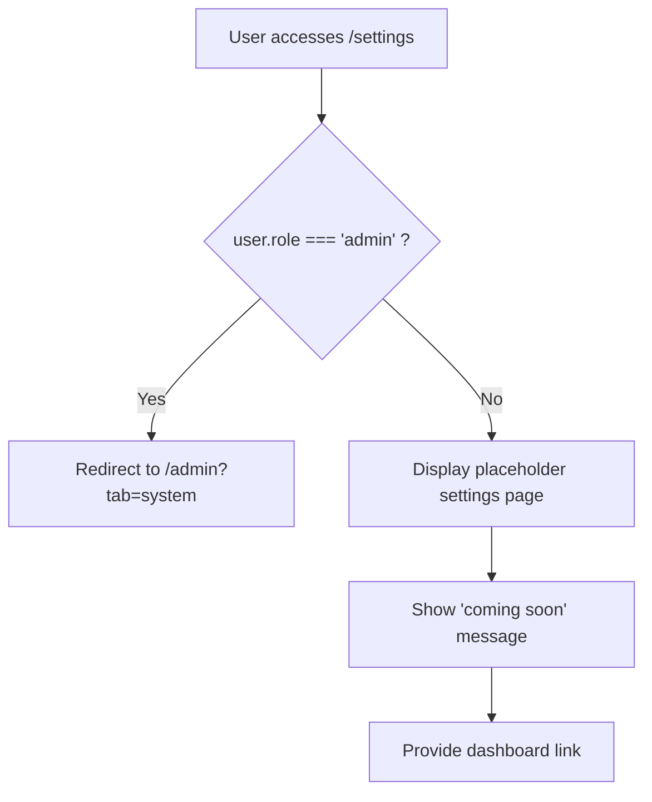

# frontend-page-Settings.md

## Overview
The `Settings.jsx` component provides user settings page with role-based access control and redirection.

## File Location
```
frontend/src/pages/Settings.jsx
```

## Dependencies - Detailed Import Analysis

```jsx
import React from 'react';
import { useAuth } from '../context/AuthContext';
import { Link, Navigate } from 'react-router-dom';
```

### Import Statement Breakdown:
- **React**: Base React import for JSX
- **Auth Context**: `useAuth` - Custom hook for authentication state
- **React Router**: `Link, Navigate` - Navigation components for routing

## Conditional Rendering with Hooks

```jsx
const Settings = () => {
  const { user } = useAuth();

  // If admin, redirect to admin system settings tab
  if (user?.role === 'admin') {
    return <Navigate to="/admin?tab=system" replace />;
  }

  // Simple user settings placeholder for non-admins
  return (
    <div className="min-h-screen px-4">
      <div className="container mx-auto px-6 py-8">
        <h1 className="text-2xl font-bold text-white mb-4">Settings</h1>
        <p className="text-sm text-gray-300 mb-6">Manage your profile and preferences</p>
        <div className="bg-slate-900/80 rounded-xl p-6 border border-slate-800">
          <p className="text-gray-300">Profile settings are coming soon. Meanwhile you can update your profile in the admin panel.</p>
          <div className="mt-4">
            <Link to="/dashboard" className="px-4 py-2 bg-blue-600 text-white rounded-lg">Back to Dashboard</Link>
          </div>
        </div>
      </div>
    </div>
  );
};
```

**Syntax Pattern**: Custom hook usage, optional chaining for safe property access, conditional rendering with early return.

## Critical Code Patterns

### 1. Custom Hook Usage
```jsx
const { user } = useAuth();
```
**Pattern**: Destructuring from custom authentication hook.

### 2. Optional Chaining for Safe Access
```jsx
if (user?.role === 'admin') {
```
**Pattern**: Safe property access without null reference errors.

### 3. React Router Navigation
```jsx
<Navigate to="/admin?tab=system" replace />
```
**Pattern**: Programmatic navigation with replace prop to prevent back button issues.

### 4. Link Component for Navigation
```jsx
<Link to="/dashboard" className="px-4 py-2 bg-blue-600 text-white rounded-lg">
```
**Pattern**: Declarative navigation using Link component with styling.

## Code Breakdown

### Component Structure
```jsx
const Settings = () => {
  const { user } = useAuth();

  // If admin, redirect to admin system settings tab
  if (user?.role === 'admin') {
    return <Navigate to="/admin?tab=system" replace />;
  }

  // Simple user settings placeholder for non-admins
  return (
    <div className="min-h-screen px-4">
      <div className="container mx-auto px-6 py-8">
        <h1 className="text-2xl font-bold text-white mb-4">Settings</h1>
        <p className="text-sm text-gray-300 mb-6">Manage your profile and preferences</p>
        <div className="bg-slate-900/80 rounded-xl p-6 border border-slate-800">
          <p className="text-gray-300">Profile settings are coming soon. Meanwhile you can update your profile in the admin panel.</p>
          <div className="mt-4">
            <Link to="/dashboard" className="px-4 py-2 bg-blue-600 text-white rounded-lg">Back to Dashboard</Link>
          </div>
        </div>
      </div>
    </div>
  );
};
```

### Key Features

#### Role-Based Redirection
- **Admin Users**: Automatically redirected to `/admin?tab=system` using React Router's `Navigate` component
- **Regular Users**: Display placeholder settings page
- Uses `replace` prop to prevent back navigation to settings page

#### Placeholder Interface
- **Header**: "Settings" title with subtitle
- **Content Card**: Dark-themed card with placeholder message
- **Navigation**: Link back to dashboard
- **Styling**: Consistent with app's dark theme using Tailwind CSS

## Flow Diagram



## Testing Examples

### Test Admin Redirection
```javascript
// Test that admin users are redirected
const mockUser = { role: 'admin' };
render(<Settings />, { wrapper: AuthProvider });
expect(screen.queryByText('Settings')).not.toBeInTheDocument();
expect(window.location.pathname).toBe('/admin');
```

### Test Regular User View
```javascript
// Test that regular users see placeholder
const mockUser = { role: 'member' };
render(<Settings />, { wrapper: AuthProvider });
expect(screen.getByText('Settings')).toBeInTheDocument();
expect(screen.getByText('Profile settings are coming soon.')).toBeInTheDocument();
```

## Related Files
- **AuthContext**: Provides user authentication state and role information
- **Admin Page**: `/admin?tab=system` - where admin users are redirected
- **Dashboard**: `/dashboard` - fallback navigation for regular users

## Future Enhancements
- User profile editing capabilities
- Password change functionality
- Notification preferences
- Theme selection
- Account deletion options

## Security Considerations
- Role-based access control prevents unauthorized access to admin settings
- Uses React Router's programmatic navigation for secure redirection
- No sensitive data exposed in placeholder interface

## Performance Notes
- Lightweight component with minimal rendering
- No API calls or heavy computations
- Uses conditional rendering for optimal performance